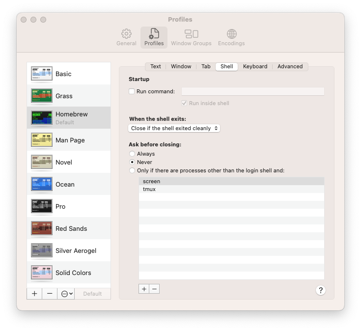

# rn-run

## React Native Development Automation Tool for MacOS
rn-run is a command-line utility written in Rust that streamlines React Native development by automating the entire app launch process for both iOS and Android platforms.

## What It Does
rn-run is a "one-command solution" for React Native developers that eliminates the tedious manual steps typically required to run React Native apps. Instead of manually:

* Stopping existing Metro bundler processes
* Closing simulators
* Managing terminal windows
* Installing dependencies
* Starting the packager
* Launching the simulator/emulator

You simply run `rn-run --ios` or `rn-run --android` and the tool handles everything automatically.

## Usage: 
```
rn-run [OPTIONS]
```

## Options:
```
  -i, --ios                    Run iOS
  -a, --android                Run Android
  -s, --simulator <SIMULATOR>  
  -c, --clean-install          Clean install
  -h, --help                   Print help
  -V, --version                Print version
```

## Setup

On MacOS you will need to set **Ask before closing** to **Never** in Terminal settings


## Installation

1. Install Rust, more info: https://www.rust-lang.org/learn/get-started
```
curl --proto '=https' --tlsv1.2 -sSf https://sh.rustup.rs | sh
```

2. Build & Install
```
cargo install rn-run
```

This will build and install the binary to `~/.cargo/bin/` on MacOS and add it to your PATH. 

## Support the Project

You can donate using Monero (XMR)

**Monero Address:** 
```
8AGHjrStt9EWEzKao7nvZNEGUHMHjWcJeWXts4wJsaog4eiE5Az4g2UjddiMLHLF6WPrKG2XT5rhcHrqqjTeedSo1RJZhNj
```
